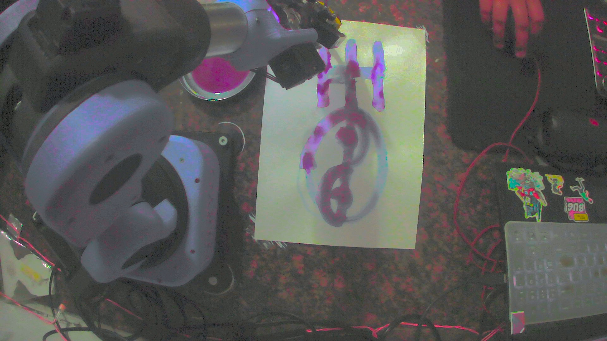
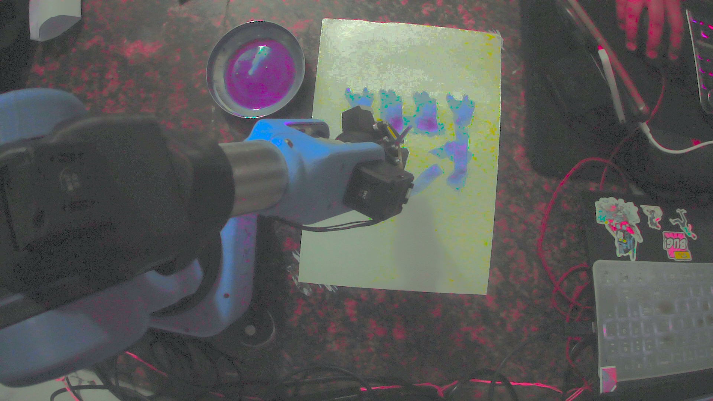
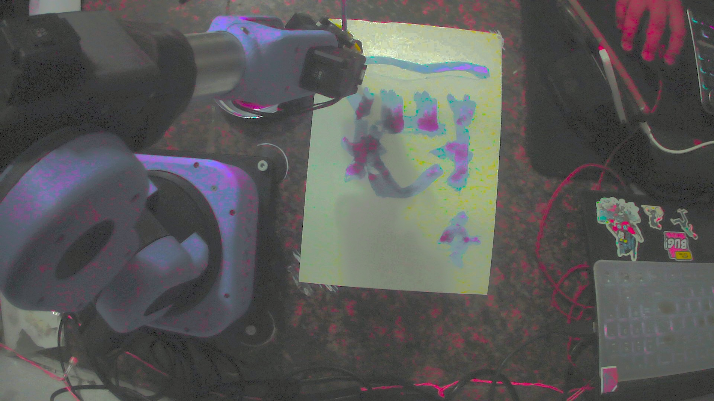
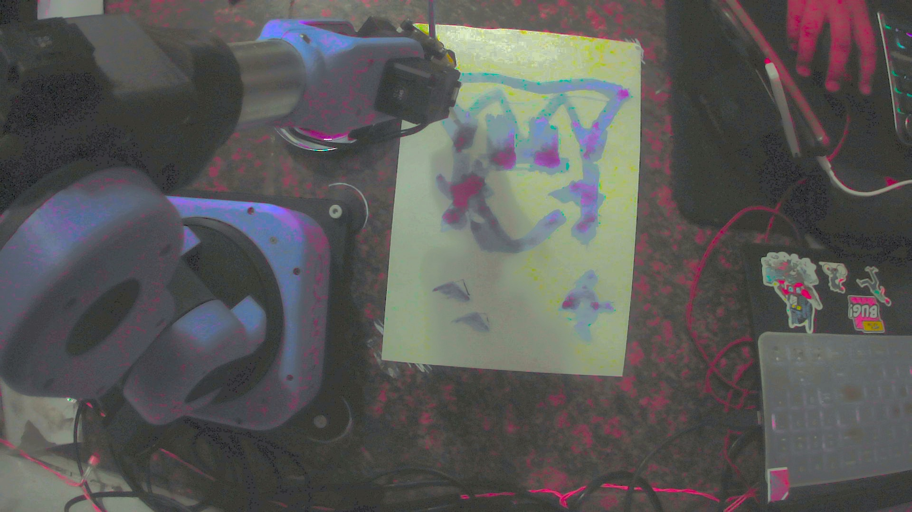

# BrushOS : Text-to-Physical Drawing with Gemini 3

**Not text-to-image. Text-to-drawing.** BrushOS is a Gemini 3 agent that controls a **camera + robot arm** to paint **real ink on real paper**, then re-observes the result and keeps improving it via structured tool calls.

**Demo video (3 min):** TODO  
**Devpost:** [Project](https://devpost.com/software/brushos-text-to-drawing-in-the-physical-world-with-gemini-3)  
**Repo:** https://github.com/Legedith/BrushOS-Robotic-painting-in-action

---

## What it does
BrushOS turns a natural-language prompt into **physical brush strokes**:

1) **Sees** the workspace through a camera (paper, brush, paint bowl/palette).  
2) **Plans** a scene as a sequence of large stroke primitives (arcs, S-curves, Béziers).  
3) **Acts** by calling robot tools to execute strokes and refill paint.  
4) **Checks** progress with new camera captures.  
5) **Refines** composition by adding/correcting strokes.

The pipeline is intentionally constrained to **big, continuous strokes** because real brushes are messy and fine detail is unreliable.

---

## Evidence (images + tool-call logs)

**Tools check (brush + paint bowl + paper):**  


**Cave art run (iterative refinement):**  
  
  


**Run transcript:** `docs/logs/run.logs`

Example excerpt:
```text
Tool call: build_bezier_stroke {"p0_u": 0.35, "p0_v": 0.45, ...}
Tool call: concat_strokes {"strokes_json": "[[[0.7,0.45],[0.75,0.55],[0.7,0.6]], ...]"}
Tool call: arm_draw_strokes {"strokes_json": "[[[0.35,0.45],...]]", "refill_after": 2}
Tool call: capture_photo_tool {"prefix": "final_cave_art_result", "output_dir": "captures\\agent_runs\\..."}
Tool output: arm_draw_strokes {"status": "success", "strokes": 8, "poses_file": "data/poses.json"}
````

---

## High-level architecture

```
Camera frames
   ↓
Gemini 3 (planner/controller)
   ↓ tool calls
Camera tools + Stroke/geometry tools + Robot tools
   ↓
Robot executes strokes → captures result → Gemini evaluates → next actions
```

---

## Hardware setup (what you need)

* Robot arm (tested with Niryo via `pyniryo`)
* Overhead/side camera with a stable view of the paper
* Paper fixed in place
* Brush held by the gripper
* Paint bowl/palette in reach

---

## Safety notes

This is a real robot moving in the real world. Keep it boring and safe:

* Keep an emergency stop accessible.
* Keep the workspace clear.
* Start with slow speed/acceleration and a large paper frame.
* Re-teach poses if anything shifts (paper, camera, bowl).

---

## Quickstart

### 1) Install

```bash
uv sync
```

### 2) Set your API key

Set one of:

* `GOOGLE_API_KEY`
* `GOOGLE_API_KEYS`

### 3) Teach the workspace (paper corners + bowl pose)

This writes the calibrated workspace into `data/poses.json`.

```bash
uv run scripts/teach_poses.py --ip 10.10.10.10 --poses-file data/poses.json
```

### 4) Run the agent

```bash
uv run scripts/run_camera_agent_interactive.py
```

Example prompt:

```text
Design a large cave-art scene with big strokes only.
Refill after every 1-2 strokes. Capture after each major addition.
```

---

## Configuration

### Environment variables

* `GOOGLE_API_KEY` or `GOOGLE_API_KEYS` (required)
* `NIRYO_ROBOT_IP` (optional override; default `10.10.10.10`)

### Version note

If your robot server warns about version mismatch, this repo pins `pyniryo` to `1.2.3` (see `pyproject.toml`).

---

## Repo layout

* `camera_agent/` — Gemini 3 agent + stroke planning tools
* `niryo_agent/` — robot-side logic / client wiring
* `camera_tools.py` — camera capture utilities
* `niryo_tools.py` — robot tools exposed to the agent (execute strokes, refill, etc.)
* `scripts/` — runnable entrypoints (teach poses, interactive run)
* `data/poses.json` — taught workspace poses
* `docs/evidence/` — curated images
* `docs/logs/run.logs` — tool-call transcript
* `tests/` — tests

---

## What this unlocks (beyond art)

Painting is the friendliest surface area for a deeper idea: a multimodal model that outputs **grounded actions**, then uses perception to **verify and correct**. The same loop can be adapted to other camera-guided manipulation tasks that need precision and feedback.

---

## Roadmap

* Faster refinement passes (more frequent capture/evaluate)
* Better composition objectives (spacing, balance, coverage)
* Cleaner one-command runner + saved run bundles (captures + logs)

---

